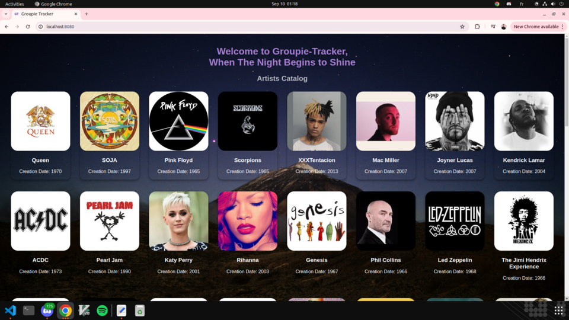
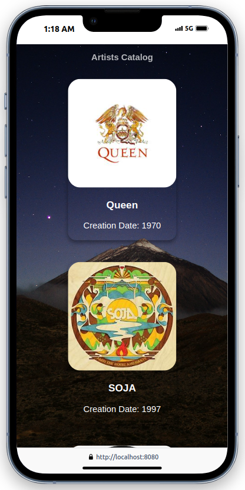
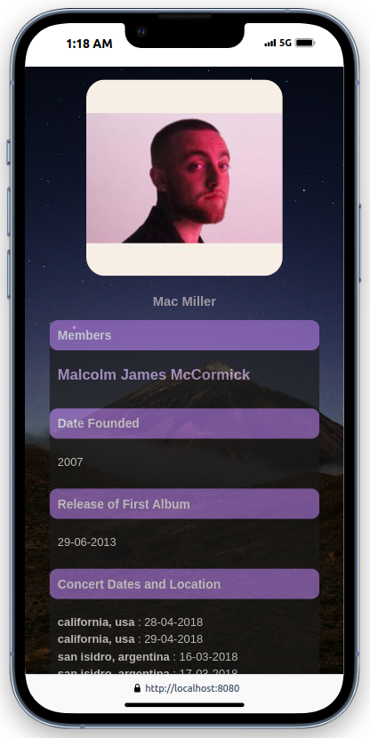
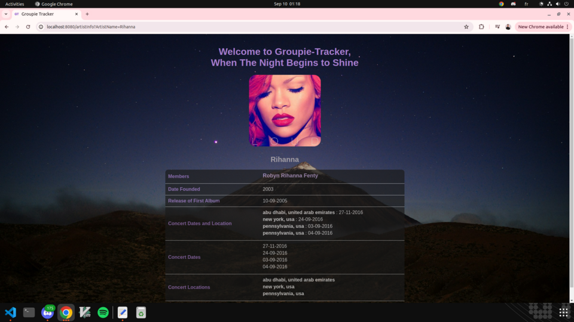

# GROUPIE-TRACKER-VISUALIZATION

Groupie Trackers consists on receiving a given API and manipulate the data contained in it, in order to create a site, displaying the information.

The API has four parts:

- **Artists**, containing information about some bands and artists like their name(s), image, in which year they began their activity, the date of their first album and the members.
- **Locations**, consists in their last and/or upcoming concert locations.
- **Dates**, consists in their last and/or upcoming concert dates.
- **Relation**,  does the link between all the other parts, artists, dates and locations.

## USAGE

### Prerequisites

- [Go](https://go.dev/doc/install) must be installed on your machine.

### Installation

To use the program, follow these steps:  

1. Clone the repository:

```
git clone <repository-URL>
cd <repository-name>
````

2. Open your terminal and run the following command to launch the server:

```
go run .
```

3. Open your web browser and navigate to: 

```
http://localhost:8080
```

The default port is 8080, but you can choose your custom port:

```
go run . -port <custom port>
```

Then you need to navigate to:

```
http://localhost:<custom port>
``` 

Web user interface with different catalogs of different artists.

- Navigate to the homepage to view a list of artists.
- Click on any artist to view detailed information including their concert dates and locations.

*Responsive User Interface*
<div style="display: flex; justify-content: space-between;">
    
    
    
    

</div>

## Algorithm

The program's algorithm follow several key steps: 
1. <b>Fetch data via API:</b> It sends HTTP requests to fetch data from the four parts of the API (artists, venues, dates, relationships) and then decodes the received JSON responses and transforms them into usable Go data structures.
2. <b>Data Display:</b> Uses HTML templates to display information about artists, concerts, and other details which are then implemented as visualization elements such as tables, lists, maps, or charts to make the data more accessible and understandable.
3. <b>Error Handling:</b> Verify that data received from the API is valid before using it.

## Authors

- ***Ndiasse Dieye***
- ***Otchoun Agiel***
- ***Abdelilah Sadiqui***

## License

This project is open-sourced under [the MIT License](https://opensource.org/license/mit).
